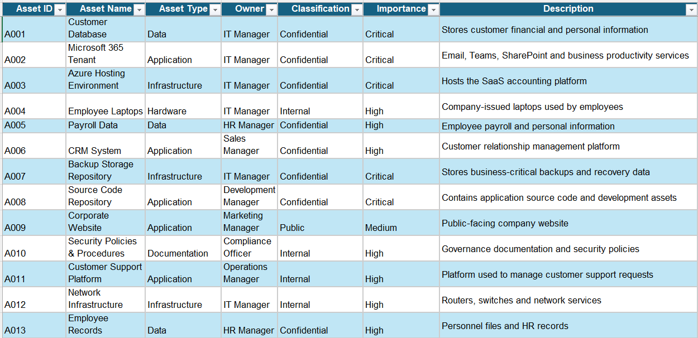
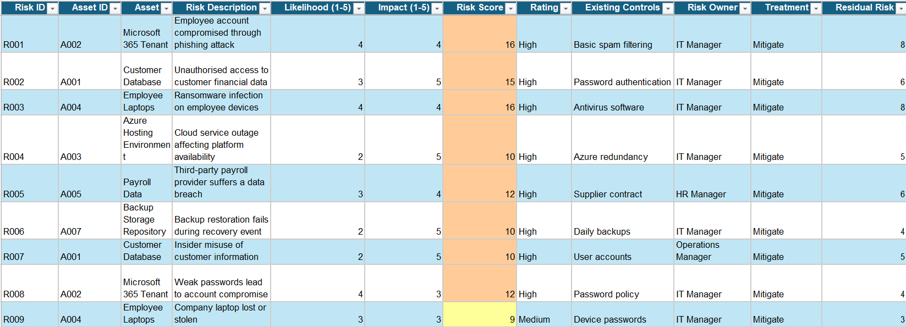
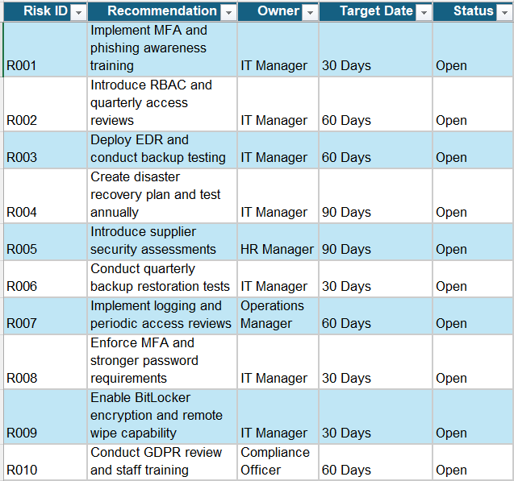

# Cybersecurity Risk Assessment

## Overview

This project demonstrates a cybersecurity risk assessment conducted for **CloudLedger Ltd**, a fictional UK-based Software-as-a-Service (SaaS) company with 50 employees.

The assessment identifies critical information assets, evaluates cybersecurity risks, and recommends treatment actions to reduce risk exposure and improve the organisation's security posture.

---

## Scope

The assessment covers:

- Customer data
- Microsoft 365 environment
- Azure cloud infrastructure
- Employee laptops
- Third-party suppliers
- Security governance processes

---

## Deliverables

- Company Profile
- Asset Inventory
- Risk Register
- Risk Treatment Plan
- Executive Summary

---

## Skills Demonstrated

- Risk Assessment
- Risk Identification
- Risk Analysis
- Risk Treatment Planning
- Information Security Governance
- Information Asset Management

---

## Asset Inventory

---

## Risk Register

---

## Risk Treatment Plan

---

## Key Risks Identified

- Phishing and account compromise
- Customer data breaches
- Ransomware attacks
- Third-party supplier risks
- GDPR compliance risks
- Source code exposure

---

## Outcome

The assessment produced a risk register, treatment plan and recommendations designed to reduce organisational risk and support secure business operations.
